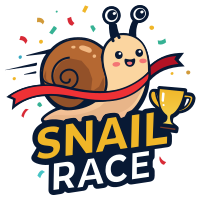

<div align="center">



# Snail Race

### 달팽이 레이싱 추첨 게임

누가 1등을 할지 아무도 모른다! 달팽이들의 숨 막히는 레이스로 추첨을 결정하세요.

<br />

[**지금 바로 플레이 &rarr;**](https://www.snailrace.site/)

<br />

</div>

---

## 게임 소개

**Snail Race**는 참가자 이름을 입력하면 달팽이들이 트랙 위를 달리며 순위를 결정하는 **추첨/뽑기 게임**입니다.
회식 자리 벌칙 정하기, 팀 순서 정하기, 발표 순서 추첨 등 다양한 상황에서 활용할 수 있습니다.

### 주요 기능

- **2~15명** 참가 지원
- 줄바꿈 / 쉼표 / 탭 등 **다양한 구분자** 자동 인식
- 동명이인 자동 넘버링 (철수 &rarr; 철수(1), 철수(2))
- 참가자 순서 **섞기(Shuffle)**
- 카운트다운 &rarr; 레이스 &rarr; 실시간 순위 &rarr; 결과 발표
- **스킵** 버튼으로 즉시 결과 확인
- 결과 후 **다시 레이스** / **참가자 변경**
- 배경음악 ON/OFF
- 모바일 가로 모드 안내
- 우승 시 폭죽 이펙트

---

## 기술 스택

| 분류 | 기술 |
|------|------|
| Framework | Next.js 16 (App Router, Turbopack) |
| Language | TypeScript |
| UI | React 19, Tailwind CSS 4, Framer Motion |
| Effects | Canvas Confetti |
| Deploy | Vercel |

---

## 로컬 실행

```bash
# 의존성 설치
npm install

# 개발 서버
npm run dev

# 프로덕션 빌드
npm run build && npm start
```

`http://localhost:3000`에서 확인할 수 있습니다.

---

## 프로젝트 구조

```
src/
├── app/
│   ├── layout.tsx          # 루트 레이아웃 (하늘 배경, 구름)
│   ├── page.tsx            # 메인 페이지
│   └── globals.css         # 전역 스타일 & Clay 디자인 토큰
├── components/
│   ├── ParticipantInput.tsx # 참가자 입력 화면
│   ├── RaceTrack.tsx       # 레이스 트랙 & 게임 루프
│   ├── RaceHeader.tsx      # 타이틀 & 실시간 순위 스트립
│   ├── RaceControls.tsx    # 시작/다시/변경 버튼
│   └── SnailSvg.tsx        # 달팽이 SVG 컴포넌트
└── lib/
    └── raceEngine.ts       # 레이스 물리 엔진
```

---

## 라이선스

MIT

